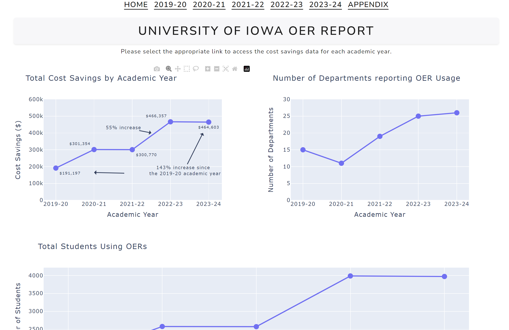

# Hi there, I'm Griffin Engel

## About Me

I'm an aspiring **Academic Libarian or Data Analyst** with experience in **assisting others in analyzing and visualizing their data, and web design**.

- Currently learning: **Observable (Notebooks & Framework), D3, & ArcGIS**
- Working on: **University of Iowa OER Dashboard**
- Languages: **Python (Data analysis & visualization), some Javascript, English**
- How to reach me: **<gnengel07@gmail.com>**

## My Skills

Data Analysis & Visualization
  

Web Design/Development

## Featured Projects

### [Iowa OER Cost Savings Dashboard](http://s-lib007.lib.uiowa.edu:8050/)

**Iowa Open Educational Resource Cost Savings Dashboard** is a **data dashboard to show OER cost savings from the 2019-2020 academic year to the 2023-2024 academic year** built with **Python, Pandas, Numpy, Plotly, Excel, and Dash Studio**. This project demonstrates my ability to **manage, ingest, clean, transform, and visualize data given to me by my practicum advisor**. You can check out the repository [here](https://github.com/GriffEngel/practicum-dash-app)

### [Insurance Dashboard built with Observable Framework](https://griffin-engel.observablehq.cloud/insurance-dashboard/)

## Get in Touch

- [**Portfolio Site**](https://griffengel.github.io/)
- [**Tableau Public Profile**](https://public.tableau.com/app/profile/griffin.engel/vizzes)
- [**LinkedIn**](https://www.linkedin.com/in/griffin-engel-066b12224/)
- [**X/Twitter**](https://twitter.com/DataVizGriff) (Data Visualization Account)

<!---
CoreSNK/CoreSNK is a ✨ special ✨ repository because its `README.md` (this file) appears on your GitHub profile.
You can click the Preview link to take a look at your changes.
--->
